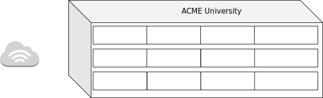

# Zadanie 2

## Projekt sieci lokalnej dla jednostki dydaktycznej uniwersytetu

### Cel Projektu
  Zaprojektowanie i weryfikacja działania sieci w środowisku testowym. 
  Rozwiązanie zapewnia dostęp do internetu dla wszystkich urządzeńw infrastrukturze.
  
### Założenia projektu

* Sieć zlokalizowana jest w budynku 3 kondygnacyjnym
* Na kążdej z kondygnacji znajdują się laboratoria komputerowe kolejno:
  * poziom 0 
    * 009, 013, 014
  * poziom 1
    * 115, 116, 117, 122
  * poziom 2
    * 201, 202, 203 
* Każde z laboratoriów wyposażone jest w 35 stanowisk dla uczestników kursów
* Jednostka planuje otworzenie kolejnych laboratoriów 017 oraz 204
* Każda kondygnacja wyposażona jest w izolowaną sieć Wi-Fi, udostępniajacą sieć internet podłączonym gościom
  * Sieć Wi-Fi nie pozwala na bezposrednią komunikację z urządzeniami zlokalizowanymi w pozostałej części sieci,
    tj: laboratoria, serwery jednostki
  * Prognozowana maksymalna liczba jednoczesnych urządzeń podłączonych do sieci to ``800``
* Jednostka posiada przyłącze internetowe oraz dysponuje pulą adresów ``188.156.220.160/27``
* Jednostka posiada serwery udostępniajace zasoby do celów dydaktycznych i promocyjnych
  * serwery zlokalizowane są w osobnym pomieszczeniu
  * udostępniają zasoby w sieci publicznej z wykorzystaniem sieci ``188.156.220.160/27``
  * Jeden serwer pełni rolę bramy dla urządzań w sieci lokalnej ``LAN``

### Wstępne założenia

* Każde laboratorium posiada oddzielną podsieć pozwalającą efektywnie zidentyfikować urządzania
  * kondygnacja oraz sala
* Dla uniknięcia zbyt słabego zasięgu sieć WiFi zostanie wyposażona w 4 urządzenia nadawcze na każdej kondygnacji
 

#### zadanie - wymaganai

* Dokonaj podziału i projektu sieci w formie dokumentu w formacie ``MARKDOW`` zawierającego specyfikację tekstową oraz obrazkową
  projektowanej sieci
* Przygotuj prototyp rozwiązania z wykorzystaniem oprogramowania ``VirtualBox`` lub podobnego.
* W specyfikacji uwzględnij wielkości sieci oraz ich adresy
* W specyfikacji uwzględnij konfigurację tablicy routingu
* Dokumentację graficzną stworzonej architektury przygotuj w programie ``DIA`` lub podobnym

--------------
# Rozwiązanie

S0
---
|  interfejs  |  adres  |
|:------------|:--------|
| enp0s3 | od dostawcy internetu |
| enp0s8 | 188.156.220.161/28 |
| enp0s9 | 188.156.220.177/28 | 

S1
---
|  interfejs  |  adres  |
|:------------|:--------|
| enp0s3 | 188.156.220.162/28 |
| enp0s9 | 192.168.9.0/26 |
| enp0s13 | 192.168.13.0/26 |
| enp0s14 | 192.168.14.0/26 |
| enp0s17 | 192.168.17.0/26 |
| enp0s115 | 192.168.115.0/26 |
| enp0s116 | 192.168.116.0/26 |
| enp0s117 | 192.168.117.0/26 |
| enp0s122 | 192.168.122.0/26 |
| enp0s201 | 192.168.201.0/26 |
| enp0s202 | 192.168.202.0/26 |
| enp0s203 | 192.168.203.0/26 |
| enp0s204 | 192.168.204.0/26 |

S2
---
|  interfejs  |  adres  |
|:------------|:--------|
| enp0s3 | 188.156.220.178/28 |
| enp0s* | 10.0.0.0/22 | 
